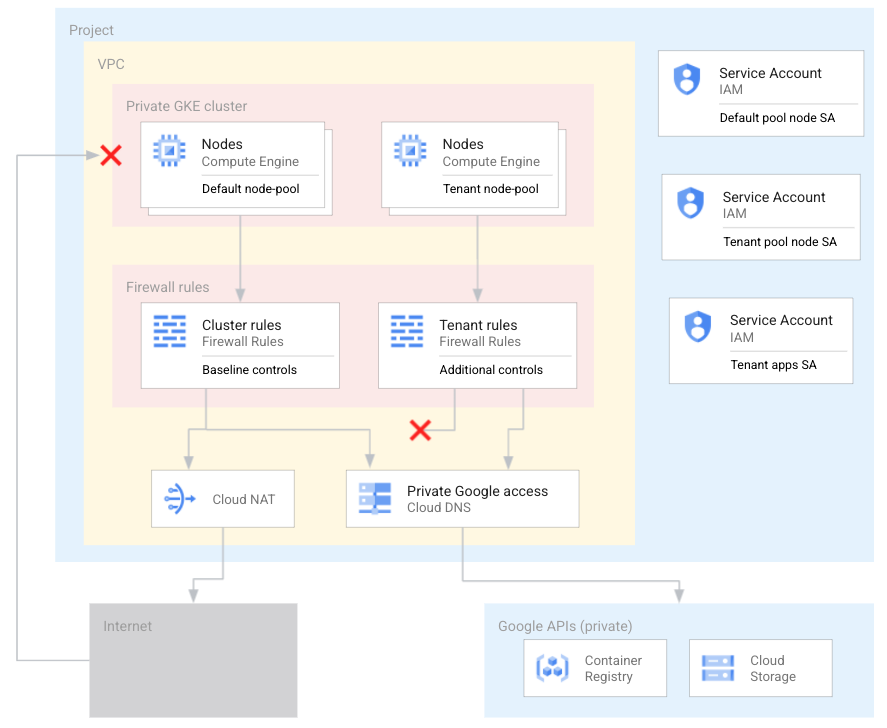

# [WIP] Anthos for federation setup blueprint

This repository contains a blueprint that creates Google Cloud infrastructure that is ready to participate in 
federated computations such as [federated learning](https://en.wikipedia.org/wiki/Federated_learning). 

Specifically, the blueprint creates and configures a Google Kubernetes Engine (GKE) cluster and related infrastructure
such that the cluster is ready to participate as a processing node ("silo") in a federated computation. The federated
computation may involve running third party apps or models; these third party resources are treated as a tenant
within the cluster. As the tenant apps performing federated computation are potentially untrusted, the cluster is configured 
according to security best practices, and the tenant apps are hosted on dedicated nodes with additional controls. 
The blueprint uses [Anthos](https://cloud.google.com/anthos) features to automate and optimise the configuration and security of the cluster.

The initial version of the blueprint creates infrastructure in Google Cloud. It can be extended to Anthos clusters running on premises
or on other public clouds

## Requirements / Caveats
To deploy this blueprint you need:
- A Google Cloud project with billing enabled
- Owner permissions on the project (TODO: tighten this up)
- It is expected that you deploy the blueprint using Cloud Shell. If you want to execute locally you'll need Terraform, gcloud and kubectl
- You create the infastructure using Terraform. The blueprint uses a local [backend](https://www.terraform.io/docs/language/settings/backends/configuration.html). It is recommended to configure a remote backend for anything other than experimentation
- You use Anthos Config Management to configure your cluster. It is recommended to create a new git repository (e.g. on Github) to host cluster configs.

## Understanding the repository structure
This repository has the following folders.

* [silo-iac](silo-iac)
  
  This folder contains the Terraform code used to create the GKE "silo" cluster and associated infrastructure.

* [configsync](configsync)
  
  This folder contains the configuration and policies that are applied to your GKE cluster by Anthos Config
  Management (ACM). It is recommended to copy this directory to a new git repository that you own.

## Architecture
### Infrastructure
The following diagram describes the infrastructure created by the blueprint


The infrastructure includes:
- A private GKE cluster. The cluster nodes do not have access to the internet.
- Two GKE node-pools. You create a dedicated node pool to host the tenant apps
- Firewall rules
  - Baseline rules that apply to all nodes in the cluster.
  - Additional rules that apply only to the nodes in the tenant node-pool (via the node Service Account below). These firewall rules limit egress from the tenant nodes.
- Cloud NAT to allow egress to the internet
- Cloud DNS rules configured to enable Private Google Access such that apps within the cluster can access Google APIs without traversing the internet
- Service Accounts used by the cluster. 
  - A dedicated Service Account used by the nodes in the tenant node-pool
  - A dedicated Service Account for use by tenant apps (via Workload Identity, discussed later)

### Applications
The following diagram describes the apps and resources within the GKE cluster
TBC

## Deploy the blueprint
- Open Cloud Shell

- Clone this repo

- Change into the IaC dir  
  ```cd silo-iac```

- Review the `terraform.tfvars` file and replace values appropriately

- Set a Terraform environment variable for your project ID  
  ```export TF_VAR_project_id=[YOUR_PROJECT_ID]```

- Initialise Terraform  
  ```terraform init```

- Create the plan; review it so you know what's going on  
  ```terraform plan -out terraform.out```

- Apply the plan to create the cluster. Note this may take ~12 minutes to complete  
  ```terraform apply terraform.out```


##  Test
TCB